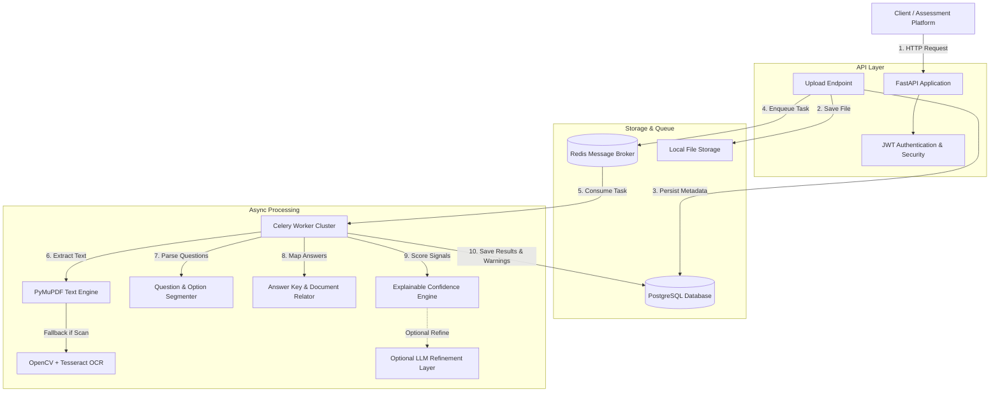
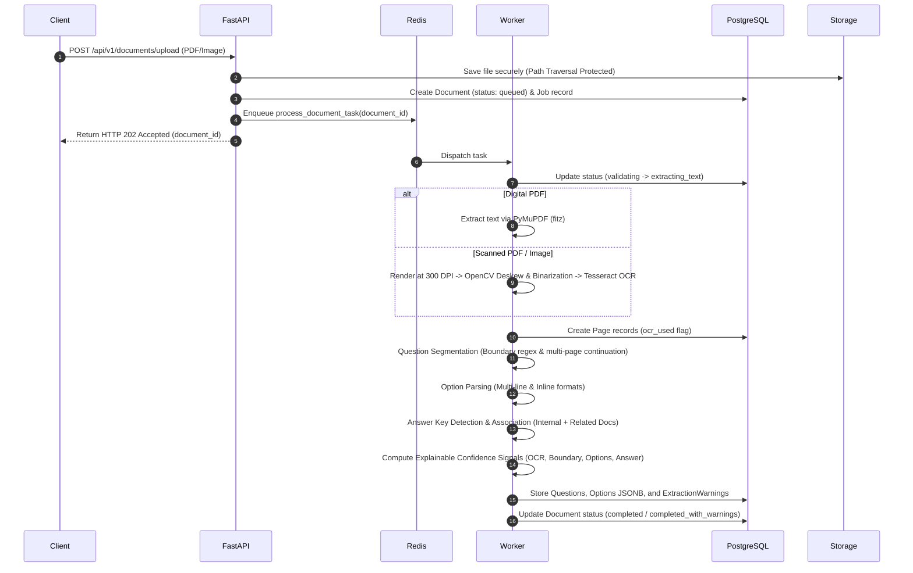

# System Architecture - Document Intelligence Service

## Architecture Overview

The Document Intelligence & Question Extraction Service is built around an asynchronous, event-driven processing pipeline designed to ingest, process, and extract structured examination content from PDFs and images reliably.

---

## Processing Pipeline Stages

---

## Core Components

### 1. API Layer (`app/api/`)
- Built with **FastAPI** for high performance, automatic OpenAPI documentation, and native Pydantic v2 data validation.
- Enforces JWT Bearer authentication for strict tenant isolation.

### 2. File Storage Abstraction (`app/storage/`)
- Implements `StorageProvider` interface with `LocalStorageProvider` concrete class.
- Prevents path traversal security vulnerabilities by enforcing canonical directory resolution.

### 3. Extraction Engine (`app/extraction/`)
- **PyMuPDF (`fitz`)**: Extracts vector text from digital PDFs.
- **OpenCV + Tesseract (`app/ocr/`)**: Automatically deskews, binarizes, and OCRs pages when native text density is low (< 50 chars/page).
- **Question Segmenter**: Uses pattern matchers to detect question headers (`1.`, `Q1.`, `Question 1:`, `(1)`), handles missing question numbers using generated IDs, and merges questions spanning multiple pages.
- **Option Extractor**: Parses options `A.`, `B)`, `(a)`, `1)` in both multi-line and inline formats.
- **Answer Detector**: Extracts key-value mappings (`1-A`, `2. C`) from text or linked `answer_key` documents.

### 4. Explainable Confidence Scoring (`app/extraction/confidence_calculator.py`)
Calculates a signal-weighted score (0.0 to 1.0):
$$\text{Score} = 0.25 \times S_{\text{ocr}} + 0.30 \times S_{\text{boundary}} + 0.25 \times S_{\text{options}} + 0.20 \times S_{\text{answer}}$$

Items with score $< 0.60$ or missing required answers set `review_required = True` and emit typed `ExtractionWarning` entries.

---

## Horizontal Scalability Strategy

- **Stateless API Instances**: FastAPI app instances can be scaled horizontally behind an NGINX / Cloud Load Balancer.
- **Celery Worker Pool**: Celery workers scale independently across worker nodes consuming from Redis queues.
- **Database Connection Pooling**: SQLAlchemy manages connection pooling to PostgreSQL.
